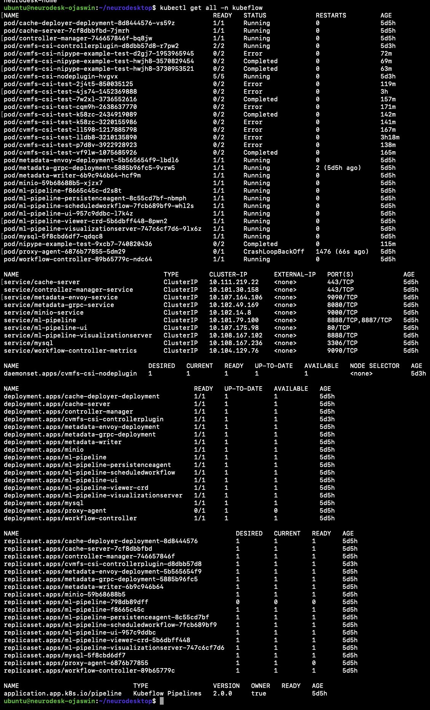

# Neurodesktop Batch Workflow System

This project integrates a batch workflow system into Neurodesktop, allowing users to submit notebooks for batch processing.

## Table of Contents
1. [Project Overview](#1-project-overview)
2. [Prerequisites](#2-prerequisites)
3. [Setup Guide](#3-setup-guide)
      - [Neurodesktop Setup](#31-neurodesktop-setup)
      - [Kubeflow Pipelines Setup](#32-kubeflow-pipelines-setup)


## 1. Project Overview

This project integrates a batch workflow system into Neurodesktop by combining Elyra and Kubeflow Pipelines. It allows Neurodesktop users to develop Jupyter notebooks in Neurodesktop and submit them as batch jobs for execution on Kubeflow Pipelines, a Kubernetes-based system.

Kubeflow Pipelines is a platform for building, deploying, and running machine learning (ML) workflows. It uses Docker containers to run components of a pipeline and enables efficient execution of tasks, both in series and parallel, by organising them into a computational directed acyclic graph (DAG). Kubeflow Pipelines also offers features like tracking pipeline runs, managing ML artifacts, and optimising resource usage. Pipelines are authored in Python using the KFP SDK, compiled into YAML, and submitted to a KFP backend, which can run on local Kubernetes clusters like Minikube or on cloud services. In this project, we will run Kubeflow Pipelines on a Minikube Kubernetes cluster, and <u>**the pipelines will be authored using Elyra**</u>.

In this setup, Elyra is used to create and manage pipelines. Its Pipeline Visual Editor in JupyterLab simplifies the process of converting multiple notebooks into batch jobs. Since Elyra is already included in the Dockerfile of this repository (OjaswinKohli/neurodesktop), building these pipelines directly from the notebooks is straightforward and efficient.

The Neurodesktop container runs on the same machine as the Minikube cluster that hosts Kubeflow Pipelines. To ensure that Neurodesktop’s neuroimaging tools are available within the pipelines, CVMFS-CSI is used to expose the necessary modules and tools. A Persistent Volume Claim (PVC) is created within the cluster, allowing these resources to be accessed by the runtime image executing the Jupyter notebooks.

## 2. Prerequistes
- Minikube: Used to deploy Kubeflow Pipelines on a local Kubernetes cluster.
- Docker: Required for running Neurodesktop.

## 3. Setup Guide

### 3.1 Neurodesktop Setup

1. **Clone the OjaswinKohli/neurodesktop repository** \
    Clone the Neurodesktop repository using the following command:
    ```bash
    git clone https://github.com/OjaswinKohli/neurodesktop.git
    ```
    After cloning, navigate to the repository:
    ```bash
    cd neurodesktop
    ```

2. **Build and Run Neurodesktop using Docker** \
   If you are using Linux, run the following script to build and run Neurodesktop:
    ```bash
    chmod +x ./build_and_run_on_linux.sh 
    ./build_and_run_on_linux.sh 
    ```

   If you are using Windows Subsystem for Linux (WSL), run this script instead:
    ```bash
    chmod +x ./build_and_run.sh 
    ./build_and_run.sh 
    ```

3. **Access Neurodesktop** \
  Once the script finishes, Neurodesktop will be accessible on port 8888. Open the link printed in the terminal using a web browser. \
  If you are running the Neurodesktop container on a Linux server and want to access it from your local computer's browser, forward your local port 8888 to the Linux server's port 8888 where the Neurodesktop container is running:
    ```bash
    ssh -L 8888:localhost:8888 user@linux-server-ip
    ``` 

### 3.2 Kubeflow Pipelines Setup

1. **Start a Minikube Cluster**:
    ```bash
    minikube start --cpus=5 --memory=9216
    ```

2. **Deploy Kubeflow Pipelines (v2.0.0)**
    ```bash
    export PIPELINE_VERSION=2.0.0
    kubectl apply -k "github.com/kubeflow/pipelines/manifests/kustomize/cluster-scoped-resources?ref=$PIPELINE_VERSION"
    kubectl wait --for condition=established --timeout=60s crd/applications.app.k8s.io
    kubectl apply -k "github.com/kubeflow/pipelines/manifests/kustomize/env/dev?ref=$PIPELINE_VERSION"
    ```

3. **Check Deployment Status**
    ```bash
    kubectl get all -n kubeflow
    ```

4. **Setup PVC with Neurodesk's modules and containers using CVMFS-CSI** 
    1.  Navigate to kubeflow-Pipelines-Setup from the root of the project directory:
        ```bash
        cd kubeflow-Pipelines-Setup
        ```
    2. Setup the script to install cvmfs-csi drivers and create a PVC in the 'kubeflow' namespace:
        ```bash
        ./setup_cvmfs.sh
        ```

5. **Set Up Port Forwarding**:
    - For Kubeflow Pipelines UI:
      ```bash
      kubectl port-forward $(kubectl get pods -n kubeflow | grep ml-pipeline-ui | cut -d' ' -f1) 31380:3000 -n kubeflow &
      ```
    - For Minio Object Storage:
      ```bash
      kubectl port-forward $(kubectl get pods -n kubeflow | grep minio | cut -d' ' -f1) 9000:9000 -n kubeflow &
      ```

6. **Update Hosts File**:
    ```bash
    echo '127.0.0.1  minio-service.kubeflow.svc.cluster.local' | sudo tee -a /etc/hosts
    ```

7. **Access Kubeflow Pipelines UI**:
    Open the following link in your web browser to access the Kubeflow Pipelines UI:
    ```
    http://localhost:31380
    ```
    If Kubeflow Pipelines are deployed on a Kubernetes cluster running on a Linux server and you want to access the UI from your local computer’s browser, forward your local port 31380 to the Linux server's port 31380, where the Kubeflow Pipelines UI is listening:
    ```bash
    ssh -L 31380:localhost:31380 user@linux-server-ip
    ```

8. **Access Minio Object Storage**:
    Open the following link in your web browser to access Minio Object Storage:
    ```
    http://localhost:9000
    ```
    When you open the above link, you will be prompted for authentication. Use the following credentials:
    ```
    Access Key: minio
    Secret Key: minio123
    ```
    If Kubeflow Pipelines are deployed on a Kubernetes cluster running on a Linux server and you want to access Minio Object Storage from your local computer’s browser, forward your local port 9000 to the Linux server's port 9000, where Minio is running:
    ```bash
    ssh -L 9000:localhost:9000 user@linux-server-ip
    ```

**Final Kubeflow Pipelines Deployment with CVMFS PVC**:

  
**Endpoints for Elyra**:
  - **Kubeflow Pipelines UI**: [http://localhost:31380](http://localhost:31380)
  - **Kubeflow Pipelines API**: [http://localhost:31380/pipeline](http://localhost:31380/pipeline)
  - **Minio Object Storage**: [http://minio-service.kubeflow.svc.cluster.local:9000](http://minio-service.kubeflow.svc.cluster.local:9000)


