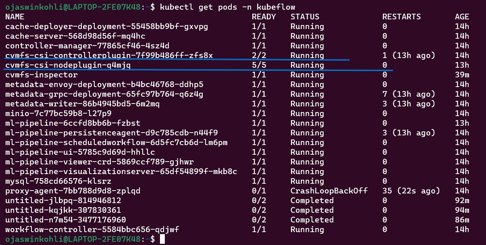
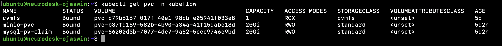
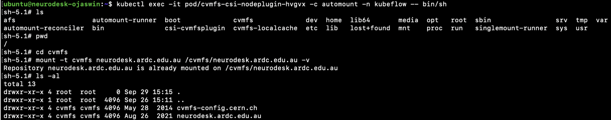

# Neurodesktop Batch Workflow System

This project integrates a batch workflow system into Neurodesktop, allowing users to submit notebooks for batch processing.

## Table of Contents
1. [Project Overview](#1-project-overview)
2. [Prerequisites](#2-prerequisites)
3. [Setup Guide](#3-setup-guide)
      - [Neurodesktop Setup](#31-neurodesktop-setup)
      - [Kubeflow Pipelines Setup](#32-kubeflow-pipelines-setup)
      - [Elyra Setup for Running Pipelines on Kubeflow Pipelines](#33-elyra-setup-for-running-pipelines-on-kubeflow-pipelines)
      - [References](#references)


## 1. Project Overview

This project integrates a batch workflow system into Neurodesktop by combining Elyra and Kubeflow Pipelines. It allows Neurodesktop users to develop Jupyter notebooks in Neurodesktop and submit them as batch jobs for execution on Kubeflow Pipelines, a Kubernetes-based system.

Kubeflow Pipelines is a platform for building, deploying, and running machine learning (ML) workflows. It uses Docker containers to run components of a pipeline and enables efficient execution of tasks, both in series and parallel, by organising them into a computational directed acyclic graph (DAG). Kubeflow Pipelines also offers features like tracking pipeline runs, managing ML artifacts, and optimising resource usage. Pipelines are authored in Python using the KFP SDK, compiled into YAML, and submitted to a KFP backend, which can run on local Kubernetes clusters like Minikube or on cloud services. In this project, we will run Kubeflow Pipelines on a Minikube Kubernetes cluster, and <u>**the pipelines will be authored using Elyra**</u>.

In this setup, Elyra is used to create and manage pipelines. Its Pipeline Visual Editor in JupyterLab simplifies the process of converting multiple notebooks into batch jobs. Since Elyra is already included in the Dockerfile of this repository (OjaswinKohli/neurodesktop), building these pipelines directly from the notebooks is straightforward and efficient.

The Neurodesktop container runs on the same machine as the Minikube cluster that hosts Kubeflow Pipelines. To ensure that Neurodesktop’s neuroimaging tools are available within the pipelines, CVMFS-CSI is used to expose the necessary modules and tools. A Persistent Volume Claim (PVC) is created within the cluster, allowing these resources to be accessed by the runtime image executing the Jupyter notebooks.

## 2. Prerequisites
- Minikube (Used to deploy Kubeflow Pipelines on a local Kubernetes cluster).
- Docker (Required for running Neurodesktop).
- Processor should have x86 Architecture.

## 3. Setup Guide

### 3.1 Neurodesktop Setup

1. **Clone the OjaswinKohli/neurodesktop repository** \
    Clone the Neurodesktop repository using the following command:
    ```bash
    git clone https://github.com/OjaswinKohli/neurodesktop.git
    ```
    After cloning, navigate to the repository:
    ```bash
    cd neurodesktop
    ```

2. **Build and Run Neurodesktop using Docker** \
   If you are using Linux, run the following script to build and run Neurodesktop:
    ```bash
    chmod +x ./build_and_run_on_linux.sh 
    ./build_and_run_on_linux.sh 
    ```

   If you are using Windows Subsystem for Linux (WSL2), run this script instead:
    ```bash
    chmod +x ./build_and_run.sh 
    ./build_and_run.sh 
    ```

3. **Access Neurodesktop** \
  Once the script finishes, Neurodesktop will be accessible on port 8888. Open the link printed in the terminal using a web browser. \
 \
  If you are running the Neurodesktop container on a Linux server and want to access it from your local computer's browser, forward your local port 8888 to the Linux server's port 8888 where the Neurodesktop container is running:
    ```bash
    ssh -L 8888:localhost:8888 user@linux-server-ip
    ``` 

### 3.2 Kubeflow Pipelines Setup

1. **Start a Minikube Cluster**:
    ```bash
    minikube start --cpus=5 --memory=9216
    ```

2. **Deploy Kubeflow Pipelines (v2.0.0)**
    ```bash
    export PIPELINE_VERSION=2.0.0
    kubectl apply -k "github.com/kubeflow/pipelines/manifests/kustomize/cluster-scoped-resources?ref=$PIPELINE_VERSION"
    kubectl wait --for condition=established --timeout=60s crd/applications.app.k8s.io
    kubectl apply -k "github.com/kubeflow/pipelines/manifests/kustomize/env/dev?ref=$PIPELINE_VERSION"
    ```

3. **Check Deployment Status**
    ```bash
    kubectl get all -n kubeflow
    ```

4. **Provision PVC for Neurodesk's Modules and Containers with CVMFS-CSI** 
    1.  Navigate to the `kubeflow-Pipelines-Setup` directory from the root of the project repository:
        ```bash
        cd kubeflow-Pipelines-Setup
        ```
    2. Run the script to install CVMFS-CSI drivers and create a PVC in the kubeflow namespace:
        ```bash
        ./setup_cvmfs.sh
        ```
    3. After the script in step 2 runs successfully, check if the CVMFS-CSI pods (named something like `cvmfs-csi-nodeplugin-` and `cvmfs-csi-controllerplugin-`) are running:

        

    4. Check if the `cvmfs` PVC is available in the kubeflow namespace:
        ```bash
        kubectl get pvc -n kubeflow
        ```
        
    5. SSH into the automount container in the cvmfs-csi-nodeplugin-***** pod. Once inside the shell, verify that the automount functionality is working by manually mounting the CVMFS repositories, which will trigger their automatic mount:
        ```bash 
        kubectl exec -it pod/cvmfs-csi-nodeplugin-***** -c automount -n kubeflow -- bin/sh
        ```
        ```bash
        mount -t cvmfs neurodesk.ardc.edu.au /cvmfs/neurodesk.ardc.edu.au
        ```
        

      6. Exit the container by typing `exit` or `logout` in the terminal.

5. **Set Up Port Forwarding**:
    - For Kubeflow Pipelines UI:
      ```bash
      kubectl port-forward $(kubectl get pods -n kubeflow | grep ml-pipeline-ui | cut -d' ' -f1) 31380:3000 -n kubeflow &
      ```
    - For Minio Object Storage:
      ```bash
      kubectl port-forward $(kubectl get pods -n kubeflow | grep minio | cut -d' ' -f1) 9000:9000 -n kubeflow &
      ```

6. **Update Hosts File**:
    ```bash
    echo '127.0.0.1  minio-service.kubeflow.svc.cluster.local' | sudo tee -a /etc/hosts
    ```

7. **Access Kubeflow Pipelines UI**:
    Open the following link in your web browser to access the Kubeflow Pipelines UI:
    ```
    http://localhost:31380
    ```
    If Kubeflow Pipelines are deployed on a Kubernetes cluster running on a Linux server and you want to access the UI from your local computer’s browser, forward your local port 31380 to the Linux server's port 31380, where the Kubeflow Pipelines UI is listening:
    ```bash
    ssh -L 31380:localhost:31380 user@linux-server-ip
    ```

8. **Access Minio Object Storage**:
    Open the following link in your web browser to access Minio Object Storage:
    ```
    http://localhost:9000
    ```
    When you open the above link, you will be prompted for authentication. Use the following credentials:
    ```
    Access Key: minio
    Secret Key: minio123
    ```
    If Kubeflow Pipelines are deployed on a Kubernetes cluster running on a Linux server and you want to access Minio Object Storage from your local computer’s browser, forward your local port 9000 to the Linux server's port 9000, where Minio is running:
    ```bash
    ssh -L 9000:localhost:9000 user@linux-server-ip
    ``` 

#### **Endpoints for Elyra if the Kubeflow Pipelines cluster and Neurodesktop are running on the same linux machine**:
  - **Kubeflow Pipelines UI**: [http://localhost:31380](http://localhost:31380)
  - **Kubeflow Pipelines API**: [http://localhost:31380/pipeline](http://localhost:31380/pipeline)
  - **Minio Object Storage**: [http://minio-service.kubeflow.svc.cluster.local:9000](http://minio-service.kubeflow.svc.cluster.local:9000)
  - **Object Storage Username**: minio
  - **Object Storage Password**: minio123

#### **Endpoints for Elyra if the Kubeflow Pipelines cluster and Neurodesktop are running on the same WSL2 (Windows Subsystem for Linux) machine**:
  - **Kubeflow Pipelines UI**: [http://host.docker.internal:31380](http://host.docker.internal:31380)
  - **Kubeflow Pipelines API**: [http://host.docker.internal:31380/pipeline](http://host.docker.internal:31380/pipeline)
  - **Minio Object Storage**: [http://host.docker.internal:9000](http://host.docker.internal:9000)
  - **Object Storage Username**: minio
  - **Object Storage Password**: minio123

### 3.3 Elyra Setup for Running Pipelines on Kubeflow Pipelines

To run the pipelines using Elyra on Kubeflow Pipelines, ensure you have completed the steps in sections [3.1](#31-neurodesktop-setup) and [3.2](#32-kubeflow-pipelines-setup). At this point, both **Neurodesktop** and **Kubeflow Pipelines** should be running and properly configured.

#### Step 1: Access the Visual Pipeline Editor

1. Open JupyterLab launcher on your Neurodesktop environment.
2. In the JupyterLab launcher, under the `Elyra` category, click on `Kubeflow Pipeline Editor` to create a new pipeline.
3. The Kubeflow Pipeline Editor will open an empty canvas where you can add components also called nodes (like Jupyter Notebooks, Python Scripts and R Scripts), connect them, and configure their properties [2].

#### Step 2: Configure the Runtime for Kubeflow Pipelines

You need to create a runtime configuration in Elyra to connect to your **Kubeflow Pipelines** instance:

1. In JupyterLab, open the `Runtimes` tab from the  JupyterLab's left sidebar [3].
2. Click the `+` button to add a new runtime configuration [3].
3. Select `Kubeflow Pipelines` as the runtime configuration type [3].
4. Provide the following details:
    - **Name**: Enter a meaningful name (in our case, "Neurodesktop Kubeflow Runtime") [3].
    - **Kubeflow Pipelines API Endpoint**: Refer to the Kubeflow Pipelines API endpoint from the **Endpoints for Elyra** section in [3.2](#endpoints-for-elyra-if-the-kubeflow-pipelines-cluster-and-neurodesktop-are-running-on-the-same-linux-machine).
    - **Minio Endpoint**: Use the Minio Object Storage endpoint and credentials from the **Endpoints for Elyra** section in [3.2](#endpoints-for-elyra-if-the-kubeflow-pipelines-cluster-and-neurodesktop-are-running-on-the-same-linux-machine).

#### Step 3: Configure the Runtime Image

Configure the runtime image that Elyra will use to execute each pipeline node (e.g., Jupyter Notebook) on Kubeflow Pipelines.

1. Open the `Runtime Images` panel from the JupyterLab's left sidebar [4].
2. Click the `+` button to add a new runtime image [4].
3. Provide the following details:
    - **Name**: A descriptive name (in our case, "Neurodesktop Runtime Image") [4].
    - **Container Image**: Specify the Docker image to be used, in our case: 
        ```
        vnmd/neurodesktop:latest
        ```
4. Save the configuration.

#### Step 4: Configure the Persistent Volume for Data Access

To access Neurodesk's modules and containers within the pipeline, you must configure a `Persistent Volume Claim (PVC)` using `CVMFS-CSI`, which is already done in section 3.2. Follow these steps to ensure data volumes are correctly set up:

1. Ensure that the `PVC` has been created in the `kubeflow` namespace (this should have been done in section 3.2).
2. In the Elyra's Kubeflow Pipeline Editor, select a node (e.g., Jupyter Notebook node) to open Node Properties to configure the data volume [5].
3. Under the `Data Volumes` [5] section of the node’s properties:
    - **Mount Path**: Specify the directory in the container where the volume will be mounted [5] (in our case, `/cvmfs`).
    - **Persistent Volume Claim Name**: Enter the name of the PVC that has been created in the `Kubeflow` namespace (in our case, `cvmfs`). 

    

4. Save the configuration. This ensures that PVC `cvmfs` is mounted on '/cvmfs' directory inside your container running the notebooks in the pipeline.

#### Step 5: Build and Submit the Pipeline

1. In the Kubeflow Pipeline Editor, drag and drop the required components (such as Jupyter Notebooks or Python scripts) to build your pipeline [2].
2. For each node (Jupyter Notebook in the pipeline) open Node Properties to select:
    - **Runtime Image**: Select the runtime image configuration that was configured in the step 3 (`Neurodesktop Runtime Image`).
    - **Data Volumes**: Ensure that the correct `Mount Path` and `PVC Name` are specified for each node as shown in step 4.
3. Before running the pipeline, add the following lines at the top of every jupyter notebook in the pipeline to set up the necessary storage permissions:
    ```python
    # For Kubeflow Pipelines
    !sudo mkdir -p /neurodesktop-storage
    !sudo chmod 777 /neurodesktop-storage
    ```
4. Select `Kubeflow` for the Runtime Platform and `Neurodesktop Kubeflow Runtime` (created in step 2) as the Runtime Configuration.
5. Once the pipeline is configured, click `Run Pipeline`, a play button in the editor’s tool bar.

#### Step 6: Monitor the Pipeline Execution

1. Open the **Kubeflow Pipelines UI** by navigating to:
    ```bash
    http://localhost:31380
    ```
2. Track the status of the pipeline, view logs, and monitor each step's progress.
3. Access any generated outputs or artifacts via **Minio Object Storage** at:
    ```bash
    http://localhost:9000
    ```
    Use the credentials:
    ```bash
    Access Key: minio 
    Secret Key: minio123
    ```

This completes the Elyra setup for running pipelines on Kubeflow Pipelines. With the configuration steps above, you should now be able to create and submit pipelines using the Elyra Pipeline Visual Editor, monitor their progress, and manage any data or outputs produced by the pipeline.

## References
[1] "Deploying Kubeflow Pipelines Locally for Elyra," Elyra Documentation, Accessed: May 2024. [Online]. Available: [https://elyra.readthedocs.io/en/latest/recipes/deploying-kubeflow-locally-for-dev.html](https://elyra.readthedocs.io/en/latest/recipes/deploying-kubeflow-locally-for-dev.html
)

[2] "Creating pipelines using the Visual Pipeline Editor," Elyra Documentation, Accessed: May 2024. [Online]. Available: [https://elyra.readthedocs.io/en/stable/user_guide/pipelines.html#creating-pipelines-using-the-visual-pipeline-editor](https://elyra.readthedocs.io/en/stable/user_guide/pipelines.html#creating-pipelines-using-the-visual-pipeline-editor)

[3] "Runtime Configuration," Elyra Documentation, Accessed: May 2024. [Online]. Available: [https://elyra.readthedocs.io/en/stable/user_guide/runtime-conf.html](https://elyra.readthedocs.io/en/stable/user_guide/runtime-conf.html)

[4] "Runtime Image Configuration," Elyra Documentation, Accessed: Aug. 2024. [Online]. Available: [https://elyra.readthedocs.io/en/stable/user_guide/runtime-image-conf.html](https://elyra.readthedocs.io/en/stable/user_guide/runtime-image-conf.html)

[5] "Pipelines," Elyra Documentation, Accessed: Aug. 2024. [Online]. Available: [https://elyra.readthedocs.io/en/v3.10.0/user_guide/pipelines.html](https://elyra.readthedocs.io/en/v3.10.0/user_guide/pipelines.html)
